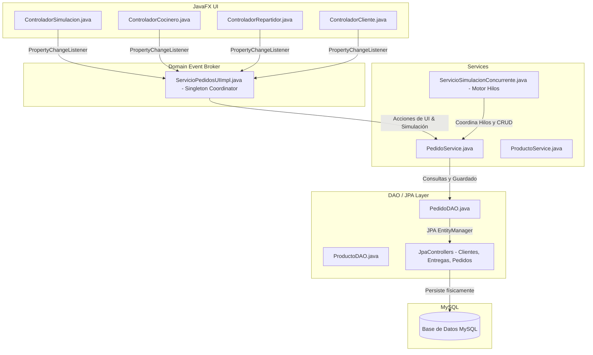
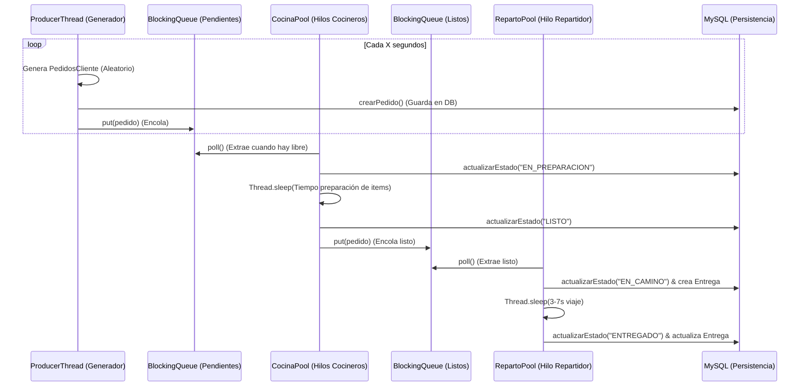

# Guía de Estudio y Documentación de Arquitectura - Sistema de Gestión Concurrente de Restaurante

Esta guía contiene la documentación técnica completa del sistema de gestión de pedidos de restaurante en Java (JavaFX + JPA/EclipseLink + MySQL). Está estructurada con explicaciones teóricas y prácticas para ser subida directamente a **NotebookLM**, permitiéndote estudiar a fondo, dominar cada componente, y asegurar la máxima nota en tu exposición.

---

## 🎯 1. Resumen Ejecutivo y Arquitectura General

El sistema es una aplicación interactiva en JavaFX que simula en tiempo real la creación, preparación, despacho y entrega de pedidos en un restaurante a través de un **modelo multihilo concurrente y reactivo**, persistiendo todo el flujo transaccional en una base de datos MySQL y sincronizando la interfaz gráfica sin polling activo.

### 🏗️ Arquitectura de Capas Unificada (Layered Architecture)

La aplicación sigue una rigurosa separación de responsabilidades para garantizar la extensibilidad y el desacoplamiento:



---

## ⚡ 2. El Motor de Concurrencia (Patrón Productor-Consumidor)

La simulación concurrente está diseñada bajo el patrón de diseño **Productor-Consumidor**, desacoplando la generación de pedidos, la cocina y el reparto mediante colas seguras para hilos (`BlockingQueue`).

### 🔄 Diagrama de Hilos y Colas de Trabajo



### 🔑 Conceptos Clave de Concurrencia a Recordar:

1. **`BlockingQueue<E>` (Colas de Bloqueo):**
   * Usamos `LinkedBlockingQueue` para `colaPendientes` y `colaListos`.
   * **¿Por qué?** Porque son colecciones seguras para hilos (`Thread-Safe`). Cuando un cocinero intenta sacar un pedido usando `poll()` y la cola está vacía, el hilo se bloquea de forma eficiente y segura **sin consumir recursos de CPU (sin polling activo)**, despertándose de inmediato cuando el Productor introduce un pedido usando `put()`.
2. **`ExecutorService` (Pools de Hilos):**
   * **Cocina (`poolCocineros`):** Un pool de hilos fijos (`Executors.newFixedThreadPool(numCooks)`) donde cada cocinero ejecuta un loop asíncrono e independiente.
   * **Reparto (`poolRepartidores`):** Un pool que maneja el despacho secuencial y entrega de pedidos listos.
3. **Apagado Ordenado ("Cerrar cocina"):**
   * Cuando presionas "Cerrar Cocina", el flag `produciendo` cambia a `false` y el `ProducerThread` se interrumpe de inmediato.
   * Sin embargo, para evitar dejar pedidos a medias, un hilo de monitoreo en segundo plano (`Sim-Shutdown-Monitor`) vigila que las colas de cocina y reparto se vacíen completamente y que los pedidos activos terminen de entregarse antes de apagar los pools de hilos (`shutdown()`). Esto asegura un cierre **elegante e íntegro (Graceful Shutdown)** sin pérdida de datos.

---

## 🎨 3. Sincronización Reactiva de Vistas (Observer Pattern)

Uno de los mayores desafíos en interfaces gráficas multitarea es actualizar la UI en tiempo real cuando ocurren eventos en hilos secundarios (como los cocineros o repartidores en segundo plano).

### 📡 El Flujo Reactivo de Eventos

1. **El Bus de Eventos (`ServicioPedidosUIImpl`):**
   Actúa como un coordinador central (Singleton). Utiliza `PropertyChangeSupport` para mantener una lista de escuchadores registrados.
2. **El Evento `pedidoActualizado`:**
   Cada vez que el Productor genera un pedido, o un cocinero/repartidor actualiza el estado en la base de datos, llama a `notificarActualizacion(pedido)`. El bus dispara el evento a todas las pantallas de forma asíncrona.
3. **`Platform.runLater(Runnable)`:**
   Las pantallas (`ControladorCocinero`, `ControladorCliente`, etc.) reciben el evento desde los hilos secundarios del Pool. 
   * **¡MUY IMPORTANTE!** En JavaFX, **solo el hilo principal de la UI (JavaFX Application Thread) puede modificar los componentes visuales**. Si un hilo secundario intenta modificar directamente una tabla o una etiqueta, se lanza un `IllegalStateException`.
   * **Solución:** Envolvemos las modificaciones de la UI en `Platform.runLater(() -> { ... })`. Esto le indica a JavaFX que encole la tarea de actualización para que sea ejecutada de forma segura por el hilo de la UI lo más pronto posible.

---

## 💾 4. Persistencia Robusta e Integridad en MySQL

Esta versión soluciona de forma definitiva los errores de inserción de datos en bases de datos MySQL sembradas o vacías mediante mecanismos avanzados de integridad.

### 🛠️ 4.1. Generación e Inserción Dinámica de Semillas
En una base de datos recién creada o vacía, intentar registrar un pedido asociado a un cliente o dirección transitoria arrojaba violaciones de clave ajena (`Foreign Key Constraint Violations`) o fallos de entidad inexistente (`EntityNotFoundException` para ID `1000`).

* **Estrategia Aplicada:**
  Al inicializar la simulación, cargamos las semillas desde MySQL (`dbClientes`, `dbProductos`, `dbPersonal`, etc.). Si la base de datos está activa pero la tabla `clientes` está vacía, el sistema **crea e inserta dinámicamente** clientes ficticios y sus direcciones en MySQL mediante `clientesController.create(cliente)`.
  Esto genera IDs autoincrementales nativos de MySQL (`IDENTITY`), los añade a la lista local y asocia entidades persistidas reales al pedido antes de guardarlo.

### 🛡️ 4.2. Bypass de Referencias en JpaController (Defensive JPA)
El código autogenerado del JpaController de Pedidos intentaba obligatoriamente invocar `em.getReference()` para cada elemento en la colección de `ItemsPedido` del pedido. Dado que los items son nuevos y sus IDs aún no existen en el sistema (esperan la autoincrementación de MySQL), esto provocaba un desplome en la inserción.

* **Estrategia Aplicada:**
  Refactorizamos el JpaController para validar defensivamente la existencia de los IDs asociados:
  ```java
  if (itemsPedidoCollectionItemsPedidoToAttach.getItemPedidoId() != null && itemsPedidoCollectionItemsPedidoToAttach.getItemPedidoId() > 0) {
      try {
          itemsPedidoCollectionItemsPedidoToAttach = em.getReference(itemsPedidoCollectionItemsPedidoToAttach.getClass(), itemsPedidoCollectionItemsPedidoToAttach.getItemPedidoId());
      } catch (javax.persistence.EntityNotFoundException e) { /* Tratar como transient */ }
  }
  ```
  Esto permite saltar las búsquedas de proxies innecesarias y delega la inserción y asociación de nuevos items al mecanismo transaccional de cascada de JPA (`CascadeType.ALL`), logrando inserts completamente limpios y estables.

### 🛵 4.3. Persistencia de Entregas (`Entregas`)
Cada vez que ocurre una transición a `EN_CAMINO`, `PedidoService` crea una entidad `Entregas` en MySQL, registrando el repartidor, el despacho y enlazándolo de forma OneToOne con el pedido. Al completarse la entrega (`ENTREGADO`), se actualiza la fecha de entrega, el estado final y el nombre de quién recibe el pedido de forma automática en la tabla `entregas`.

---

## 💻 5. Fragmentos de Código Clave (Anotados)

### 📌 A. Flujo Transaccional de Modificación de Estados (`PedidoService.java`)
Este método unifica la lógica de negocio, validaciones de transiciones de la máquina de estados, el log histórico y el registro físico de despachos/entregas:

```java
public synchronized boolean actualizarEstado(Long pedidoId, String nuevoEstadoStr, Long personalId) throws Exception {
    PedidosCliente pedido = pedidoDAO.buscarPorId(pedidoId);
    if (pedido == null) return false;

    EstadosPedido estadoOrigen = pedido.getEstadoActualId();
    EstadosPedido estadoDestino = getEstadoPorCodigo(nuevoEstadoStr);
    if (estadoDestino == null) return false;

    // 1. Validar reglas de negocio (Máquina de Estados)
    CodigoEstadoPedido actualEnum = CodigoEstadoPedido.valueOf(estadoOrigen.getCodigoEstado());
    CodigoEstadoPedido nuevoEnum = CodigoEstadoPedido.valueOf(estadoDestino.getCodigoEstado());
    if (!maquinaEstados.validarCambioEstado(actualEnum, nuevoEnum)) {
        throw new IllegalStateException("Transición inválida de " + actualEnum + " a " + nuevoEnum);
    }

    Personal personal = null;
    if (personalId != null) {
        personal = personalController.findPersonal(personalId);
    }

    // 2. Registrar el flujo de entrega física en la tabla 'entregas'
    if (nuevoEstadoStr.equalsIgnoreCase("EN_CAMINO")) {
        registrarDespacho(pedido, personal);
    } else if (nuevoEstadoStr.equalsIgnoreCase("ENTREGADO")) {
        registrarEntregaExitosa(pedido, personal);
    }

    // 3. Actualizar la entidad pedido
    pedido.setEstadoActualId(estadoDestino);
    pedido.setEstadoActualCambiadoEn(new Date());
    pedidoDAO.actualizar(pedido);

    // 4. Guardar bitácora histórica de auditoría (tabla historial_estados_pedido)
    guardarHistorial(pedido, estadoOrigen, estadoDestino, "Cambio de estado a " + nuevoEstadoStr, personal);
    return true;
}
```

### 📌 B. Persistencia del Despacho de Entregas (`PedidoService.java`)
```java
private void registrarDespacho(PedidosCliente pedido, Personal personal) {
    if (entregasController == null) return;
    try {
        Entregas e = pedido.getEntregas();
        if (e == null) {
            e = new Entregas();
            e.setPedidoId(pedido);
            e.setRepartidorPersonalId(personal != null ? personal : getRepartidorFallback());
            e.setDespachadoEn(new Date());
            e.setEstadoEntrega("EN_CAMINO");
            e.setNumeroIntento(1);
            
            entregasController.create(e); // Guarda e introduce la clave ajena en MySQL
            pedido.setEntregas(e);
        }
    } catch (Exception ex) {
        System.out.println("⚠️ Error al registrar despacho en MySQL: " + ex.getMessage());
    }
}
```

---

## 🎓 6. Estrategia de Defensa en la Exposición (Preguntas del Profesor)

Esta es la sección más valiosa para asegurar tu calificación. Prepárate con estas respuestas técnicas de alto nivel ante posibles preguntas del profesor o jurado:

### 💬 Pregunta 1: ¿Por qué usaron `BlockingQueue` en lugar de una colección sincronizada como `Vector` o `Collections.synchronizedList()` para la cocina y reparto?
* **Respuesta de Nivel Senior:** 
  > *"Las listas sincronizadas normales solo evitan colisiones de memoria en accesos simultáneos, pero carecen de mecanismos de sincronización de flujo. Si usáramos un `ArrayList` sincronizado, los hilos de los cocineros tendrían que estar constantemente haciendo consultas periódicas en un bucle (`polling activo`) para ver si hay pedidos, lo cual saturaría el procesador al 100% de forma innecesaria. 
  > `BlockingQueue` soluciona esto de raíz mediante bloqueos de hilos optimizados. Su método `poll(timeout)` suspende el hilo del cocinero de forma pasiva y sin consumo de CPU cuando la cola está vacía, y el sistema operativo lo despierta de inmediato en cuanto el productor coloca un pedido con `put()`. Esto reduce el consumo de CPU a prácticamente cero y elimina las condiciones de carrera."*

### 💬 Pregunta 2: ¿Qué es `Platform.runLater()` en JavaFX y qué ocurriría si lo eliminan?
* **Respuesta de Nivel Senior:** 
  > *"JavaFX, al igual que Swing o Android, utiliza un modelo de interfaz gráfica de un solo hilo (`Single-Threaded UI Model`). Solo el hilo principal de la aplicación, el `JavaFX Application Thread`, tiene permitido modificar la jerarquía visual de componentes (añadir filas, cambiar colores, mover barras de progreso). 
  > Dado que nuestra simulación se ejecuta en pools de hilos secundarios independientes (los cocineros y repartidores), cualquier intento de modificar la tabla o el texto visual directamente desde estos hilos paralelos lanzaría inmediatamente una excepción de tipo `IllegalStateException: Not on FX application thread`.
  > `Platform.runLater(Runnable)` permite enviar de forma segura tareas visuales desde los hilos de cocina y reparto para que sean programadas y ejecutadas de forma segura dentro del hilo principal de la UI."*

### 💬 Pregunta 3: Encontré un error de `EntityNotFoundException` para el ID `1000` en MySQL. ¿A qué se debía y cómo lo solucionaron?
* **Respuesta de Nivel Senior:** 
  > *"El error se debía a un fallo de integridad referencial. Cuando la base de datos estaba vacía (sin clientes registrados previamente), el generador de pedidos creaba un cliente temporal con ID `1000` solo en memoria. Al intentar persistir el pedido en MySQL, EclipseLink llamaba a `em.getReference()` sobre el cliente `1000` para validar la clave foránea. Como la entidad no existía físicamente en la tabla `clientes`, JPA abortaba la transacción arrojando la excepción `EntityNotFoundException`.
  > Lo solucionamos de dos maneras:
  > Primero, implementamos una inicialización dinámica de semillas. Si detectamos que las colecciones están vacías, el sistema crea e inserta físicamente clientes y direcciones reales en la base de datos mediante sus JpaControllers, obteniendo IDs autoincrementales reales y persistidos.
  > Segundo, refactorizamos defensivamente el JpaController de Pedidos para que no intente resolver proxies de entidades cuyos IDs sean nulos o no estén en la base de datos, permitiendo que elementos nuevos como los `ItemsPedido` sean guardados de forma fluida a través del mecanismo de cascada `CascadeType.ALL` de JPA."*

### 💬 Pregunta 4: ¿Cómo garantizan que al presionar "Cerrar Cocina" no se pierdan los pedidos que están siendo preparados por los cocineros?
* **Respuesta de Nivel Senior:** 
  > *"Implementamos un mecanismo de parada ordenada (`Graceful Shutdown`). Al desactivar el flag `produciendo`, el hilo generador (`ProducerThread`) se detiene inmediatamente. Sin embargo, no apagamos los pools de cocina y reparto de forma abrupta con `shutdownNow()`.
  > En su lugar, iniciamos un hilo de monitoreo asíncrono (`Sim-Shutdown-Monitor`) que vigila periódicamente el estado de las colas de cocina y entrega. Una vez que las colas `colaPendientes` y `colaListos` están vacías y ya no hay pedidos activos en proceso de preparación o camino, este monitor invoca el método `shutdown()` y espera pacientemente a que los pools terminen ordenadamente de forma segura. Esto garantiza cero pérdida de datos."*

### 💬 Pregunta 5: Veo que eliminaron el archivo `MainJavaFX.java` pero conservaron `AplicacionJavaFx.java` y `AplicacionConsola.java`. ¿Por qué?
* **Respuesta de Nivel Senior:** 
  > *"Eliminamos `MainJavaFX.java` porque era un cargador obsoleto que abría múltiples ventanas separadas de manera desorganizada, lo cual ya no es necesario dado que el sistema unifica todas las interfaces en el nuevo panel principal interactivo.
  > Conservamos `AplicacionJavaFx.java` y `AplicacionConsola.java` porque el suite de pruebas automatizadas del proyecto (nuestros 55 tests JUnit 5) cuenta con dependencias de compilación hacia estas clases. Eliminarlas rompería el build de compilación y evitaría que el comando `mvn test` ejecutara de manera correcta los tests de base de datos, de la interfaz de consola, y del panel visual de simulación."*
