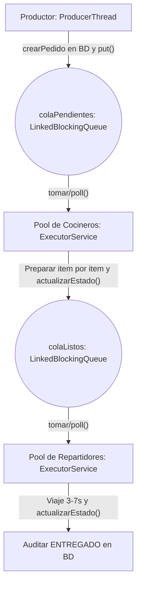

# 🍽️ Restaurante Concurrente - Sistema de Gestión y Simulación de Pedidos Multihilo

¡Bienvenido al **Sistema de Gestión de Pedidos de Restaurante de Alto Rendimiento**! Este sistema ha sido extendido bajo principios de desarrollo guiado por especificaciones (**Spec-Driven Development**), incorporando una arquitectura por capas estricta, persistencia automática en base de datos con historial de auditoría, sincronización en tiempo real entre vistas y un diseño visual premium optimizado.

El motor de simulación concurrente interactivo opera bajo el patrón **Productor-Consumidor**, coordinando hilos independientes para la toma, preparación y entrega de pedidos.

---

## 🏗️ Arquitectura de Software por Capas (Capas Implementadas)

El proyecto se rige por una separación estricta de responsabilidades en cuatro capas principales:

```text
presentacion/   ──>   negocio/servicios/   ──>   datos/dao/   ──>   dominio/modelos/
```

### 📁 Árbol de Directorios del Código Fuente

```text
src/main/java/com/restaurante/pedidos
│
├── datos
│   └── dao
│       ├── PedidoDAO.java               <-- Acceso a datos JPA/JDBC para Pedidos
│       └── ProductoDAO.java             <-- Acceso a datos JPA/JDBC para Productos
│
├── dominio
│   ├── CodigoEstadoPedido.java
│   ├── CodigoRol.java
│   ├── GeneradorCodigoPedido.java
│   ├── modelos                          <-- Modelos puros de Dominio
│   │   ├── EstadoPedido.java            <-- Enum de estados
│   │   ├── Pedido.java                  <-- Entidad simplificada inmutable
│   │   └── Producto.java                <-- Catálogo simplificado
│   │
│   ├── dto                              <-- Objetos de transferencia para la UI
│   │   ├── EstadoPedidoDTO.java
│   │   ├── ItemPedidoDTO.java
│   │   └── PedidoDTO.java
│   │
│   └── servicio
│       └── ui
│           ├── IServicioPedidosUI.java
│           ├── IServicioPersonalUI.java
│           ├── IServicioProductosUI.java
│           └── ServicioPedidosUIImpl.java <-- COORDINADOR CENTRAL DE EVENTOS EN TIEMPO REAL
│
├── negocio
│   └── servicios                        <-- Reglas de Negocio Centrales
│       ├── PedidoService.java           <-- Servicio CRUD y transiciones con auditoría
│       ├── ProductoService.java         <-- Servicio de catálogo de productos
│       └── SimulacionService.java       <-- Control del ciclo de vida del simulador
│
├── presentacion                         <-- Interfaz de Usuario y Vistas
│   ├── AplicacionConsola.java
│   ├── AplicacionJavaFx.java            <-- Lanzador del selector multiventana
│   ├── AplicacionPrincipal.java
│   ├── MainJavaFX.java
│   └── controladores                    <-- Controladores de Vistas JavaFX
│       ├── ControladorAdministrador.java
│       ├── ControladorCliente.java
│       ├── ControladorCocinero.java
│       ├── ControladorPanelPrincipal.java
│       ├── ControladorRepartidor.java
│       └── ControladorSimulacion.java
│
├── Clases                               <-- Entidades de persistencia (JPA heredadas)
│   ├── Clientes.java
│   ├── DireccionesCliente.java
│   ├── Entregas.java
│   ├── EstadosPedido.java
│   ├── HistorialEstadosPedido.java
│   ├── ItemsPedido.java
│   ├── PedidosCliente.java
│   ├── Personal.java
│   ├── Productos.java
│   ├── ReglasTransicionEstadoPedido.java
│   └── Roles.java
│
└── Logica                               <-- Controladores de Persistencia Autogenerados (JPA)
    ├── PedidosClienteJpaController.java
    ├── ProductosJpaController.java
    └── ...
```

---

## 🧵 Motor Concurrente Multihilo (Productor-Consumidor)

La simulación concurrente modela el flujo dinámico de pedidos mediante hilos independientes que operan sobre colas bloqueantes seguras:



### 🔐 Características Clave del Motor Concurrente:
1.  **LinkedBlockingQueue:** Evita colisiones de lectura y escritura entre hilos concurrentes de forma thread-safe.
2.  **Orderly Shutdown ("Cerrar Cocina"):** Desactiva inmediatamente la generación de nuevos pedidos, permitiendo que los pedidos que ya se encuentran en la cola o en curso completen su ciclo secuencial completo (`awaitTermination`) antes de liberar los recursos y apagar los pools.
3.  **Persistencia Transaccional Obligatoria:** Todo pedido generado en la simulación es guardado en MySQL de forma transaccional mediante `PedidoService.crearPedido(...)`.

---

## ⚡ Sincronización de Vistas en Tiempo Real

Para resolver la desincronización de pantallas independientes, se implementó un **Coordinador Central de Eventos Reactivo** (`ServicioPedidosUIImpl`) utilizando el patrón de diseño Observer mediante **PropertyChangeListener**:

*   **Sin Polling Activo:** Las pantallas no realizan consultas repetitivas al servidor en bucle (polling).
*   **Event-Driven:** Cuando un hilo de cocina o reparto cambia el estado de un pedido en la simulación, el motor notifica al coordinador central, quien a su vez dispara un evento `pedidoActualizado` a todos los controladores escuchando.
*   **Hilo Seguro de UI:** Cada pantalla captura el evento y ejecuta un refresco reactivo de sus tablas, tarjetas y listados utilizando `Platform.runLater()` para garantizar la integridad visual del hilo principal de JavaFX.

---

## 🎨 Paleta de Colores por Rol e Interfaz Premium

La interfaz se ha estilizado usando tipografía moderna (**Segoe UI / Roboto**), un fondo general de color gris muy claro (`#F4F6F7`) y paletas obligatorias específicas de color por rol:

| Rol | Color Principal (Hex) | Uso e Impacto Visual |
| :--- | :--- | :--- |
| **Administrador** | `#2C3E50` (Azul Gris) | Encabezados, bordes y botones de control del panel de Admin. |
| **Cocinero** | `#E67E22` (Naranja) | Paneles de cocina, estados en preparación y tarjetas de pedidos. |
| **Repartidor** | `#27AE60` (Verde) | Paneles de logística y entrega, botones de despacho de motorizados. |
| **Cliente** | `#8E44AD` (Púrpura) | Campo de búsqueda de cliente, estados de consulta y seguimiento. |
| **Simulación** | `#1ABC9C` (Turquesa) | Títulos del panel, consola de registros (logs) y barras de progreso. |

### 📜 ScrollPane Obligatorio
El panel de simulación cuenta con un contenedor **ScrollPane** que envuelve la sección de búsqueda y la consola terminal de eventos. Esto mantiene fijos y siempre visibles los botones principales de control (**Iniciar Simulación**, **Cerrar Cocina**) sin importar la resolución o tamaño de la ventana.

---

## 🧪 Pruebas Unitarias e Integración (JUnit 5)

La suite de pruebas contiene **55 pruebas automatizadas** que validan la lógica de concurrencia, persistencia y reglas de transición de la máquina de estados:

*   `testTransicionEstadoValida()`: Comprueba la máquina de estados. `PENDIENTE ──> EN_PREPARACION ──> LISTO ──> EN_CAMINO ──> ENTREGADO`.
*   `testTransicionInvalida()`: Valida que las transiciones prohibidas (por ejemplo, de `PENDIENTE` a `ENTREGADO`) lancen una excepción `IllegalStateException`.
*   `testSimulacionPersistePedidos()`: Prueba de integración que arranca el motor de simulación concurrente, lo deja operar durante 10 segundos, cierra la cocina y verifica que todos los pedidos generados han sido almacenados correctamente en la base de datos MySQL de manera automática.

### 🏃 Ejecutar Pruebas
```bash
mvn clean test
```

### 🔌 Iniciar la Aplicación
```bash
mvn clean javafx:run
```

---

## 🛠️ Fragmentos de Código Clave

### 🍳 Hilo Productor con Persistencia Transaccional (`ServicioSimulacionConcurrente.java`)
```java
private void loopProductor(int intervalSeconds) {
    while (produciendo) {
        try {
            PedidosCliente pedido = generarPedidoAleatorio();
            
            // Persistir de forma obligatoria a través de la capa de servicios de negocio
            try {
                pedidoService.crearPedido(pedido);
            } catch (Exception e) {
                // Fallback autónomo en memoria si la BD está offline
            }

            colaPendientes.put(pedido);
            pedidosActivos.put(pedido.getCodigoPedido(), pedido);
            
            registrarLog(String.format("📝 Pedido %s creado para cliente '%s' (Total: $%s). PENDIENTE", 
                    pedido.getCodigoPedido(), 
                    pedido.getClienteId().getNombreCompleto(),
                    pedido.getTotal()));
            
            notificarActualizacion(pedido);
            Thread.sleep(intervalSeconds * 1000L);
        } catch (InterruptedException e) {
            break;
        }
    }
}
```

### 👨‍🍳 Actualización de Estado por Cocineros (`ServicioSimulacionConcurrente.java`)
```java
// Dentro del loopCocinero:
registrarLog(String.format("🍳 Cocinero #%d toma Pedido %s. Cambiando a: EN PREPARACIÓN", idCocinero, codigo));

try {
    // Los cocineros actualizan el estado en la base de datos auditada mediante PedidoService
    pedidoService.actualizarEstado(pedido.getPedidoId(), "EN_PREPARACION", (long) idCocinero);
    pedido.setEstadoActualId(dbEstados[2]); // EN_PREPARACION
    pedido.setEstadoActualCambiadoEn(new Date());
} catch (Exception e) {
    pedido.setEstadoActualId(dbEstados[2]); // Fallback memoria
    pedido.setEstadoActualCambiadoEn(new Date());
}
notificarActualizacion(pedido);
```
